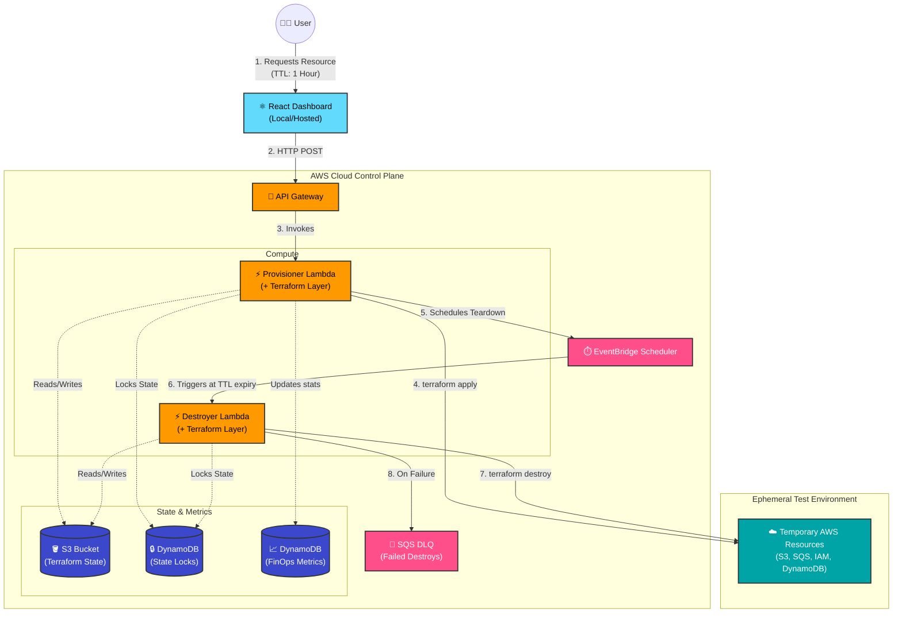

# InfraReaper

InfraReaper is a self-destructing infrastructure provisioner for temporary AWS resources. A React dashboard submits a short-lived environment request to API Gateway, a Node.js Lambda runs Terraform to provision the resource, and EventBridge Scheduler invokes a destroy Lambda when the TTL expires.

## What It Builds

- React dashboard for requesting temporary S3 buckets, IAM roles, SQS queues, or DynamoDB tables.
- **FinOps Tracker**: Automatically tracks environments destroyed and calculates hours of cloud waste prevented via a zero-cost DynamoDB counter.
- API Gateway HTTP API with optional JWT authorizer.
- Provision Lambda that validates requests, runs Terraform, and schedules cleanup.
- Destroy Lambda that runs `terraform destroy` against the matching state key.
- **Dead Letter Queue (DLQ)**: Captures any failed `terraform destroy` events to ensure no resources are silently orphaned.
- Terraform-managed S3 backend and DynamoDB lock table for per-environment state.
- Safe-by-default temporary resources with tags, private S3 settings, encryption, and TTL metadata.

## Repository Layout

```text
frontend/               React dashboard
lambdas/src/            Provision and destroy Lambda handlers
lambdas/resource/       Terraform module executed by the Lambdas
infra/                  Permanent AWS control-plane Terraform
scripts/                Packaging helpers
```

## Architecture Diagram



## Security Model

InfraReaper is designed to avoid the common trap of giving a Lambda unrestricted Terraform permissions.

- Requests are schema-validated and capped by `MAX_TTL_HOURS`.
- Resource types are allow-listed: `s3_bucket`, `iam_role`, `sqs_queue`, and `dynamodb_table`.
- All temporary resources are tagged with `Project=InfraReaper`, `EnvironmentId`, `ExpiresAt`, `RequestedBy`, and `Purpose`.
- EventBridge schedules are programmed to self-delete after execution, ensuring the control plane stays clean.
- S3 buckets are private, encrypted, and have public access blocks.
- IAM roles are created under `/infrareaper/`, have no policies attached by default, and can use a permissions boundary.
- Terraform state is isolated by environment ID in S3.
- API Gateway can be fronted by a JWT authorizer through `jwt_issuer` and `jwt_audience`.

## Local Frontend

```powershell
npm.cmd --prefix frontend install
copy frontend\.env.example frontend\.env
npm.cmd --prefix frontend run dev
```

Set `VITE_API_BASE_URL` in `frontend/.env` to the API Gateway URL from the Terraform output.

## Deployment Outline

1. Package the Lambda code:

   ```powershell
   .\scripts\package-lambda.ps1
   ```

2. Build a Lambda layer that contains the Linux Terraform binary at `/opt/bin/terraform`.

   On Windows PowerShell:

   ```powershell
   .\scripts\build-terraform-layer.ps1 -Version 1.13.4
   ```

   On Linux/macOS or WSL:

   ```bash
   ./scripts/build-terraform-layer.sh 1.13.4
   ```

3. Deploy the permanent control plane:

   ```powershell
   terraform -chdir=infra init
   terraform -chdir=infra apply `
     -var="lambda_zip_path=../dist/infrareaper-lambda.zip" `
     -var="terraform_layer_zip_path=../dist/terraform-layer.zip" `
     -var="jwt_issuer=https://YOUR_ISSUER/" `
     -var='jwt_audience=["YOUR_AUDIENCE"]'
   ```

4. Point the frontend at the `api_endpoint` output and deploy it to your preferred static host.

## API

`POST /environments`

```json
{
  "resourceType": "s3_bucket",
  "ttlHours": 4,
  "requestedBy": "dev@example.com",
  "purpose": "integration-test-branch-142",
  "name": "branch-142"
}
```

Successful responses include the environment ID, expiry timestamp, schedule name, and Terraform outputs.

## Operational Notes

- Set a low `max_ttl_hours` for shared accounts.
- Use a dedicated AWS account or OU for ephemeral resources.
- Enable CloudTrail and AWS Budget alerts for the account.
- Prefer JWT authorization in real environments; unauthenticated mode is for local demos only.
- Review and narrow `infra/lambda-policies.tf` before allowing additional Terraform resource types.

## ⚠️ Warnings & Limitations

If you are deploying this for real-world usage or evaluating it, please be aware of the following:

1. **State File Locks**: If a user manually modifies a temporary resource (e.g., changes an S3 bucket policy) or if the Terraform state file is tampered with, the `terraform destroy` command may fail. Failed destroys are routed to the SQS DLQ, but **they require manual intervention** to clean up.
2. **Lambda Timeout Constraints**: AWS Lambda has a hard timeout of 15 minutes. This architecture is designed for fast-provisioning resources (S3, DynamoDB, IAM, SQS). **Do not add long-running resources** (like RDS databases, EKS clusters, or CloudFront distributions) to the Terraform module, as they will exceed the Lambda timeout and fail to provision/destroy.
3. **Unauthenticated Access**: By default, the API Gateway is deployed without an authorizer for ease of testing. **Do not deploy this to a production AWS account without enabling the JWT Authorizer** (`jwt_issuer` and `jwt_audience` variables), otherwise anyone on the internet can spin up resources in your account.
4. **Cost of the Control Plane**: While the temporary resources are torn down automatically, the Control Plane (API Gateway, S3 backend, DynamoDB lock/metrics tables, SQS DLQ, Lambdas) remains permanently deployed. It is highly serverless and largely fits within the AWS Free Tier, but it is not completely free if heavily utilized.
